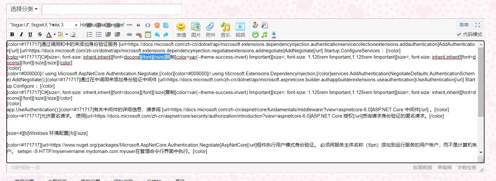
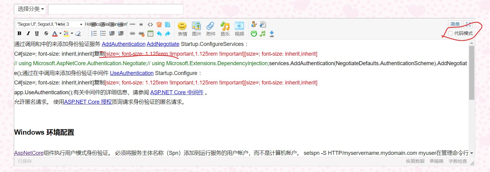
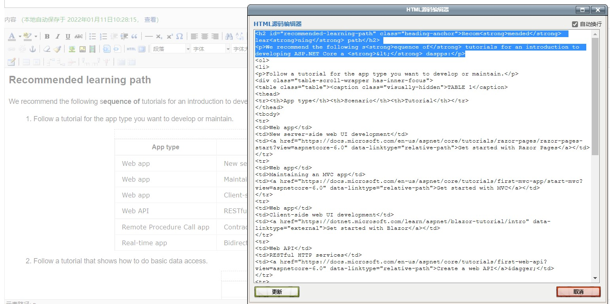

<!-- @import "[TOC]" {cmd="toc" depthFrom=2 depthTo=4 orderedList=false} -->
# Markdown简介与练习


<!-- code_chunk_output -->

- [Markdown简介与练习](#markdown简介与练习)
  - [1. 在Markdown普及以前](#1-在markdown普及以前)
  - [2. 什么是Markdown](#2-什么是markdown)
  - [3. Markdown常用基础语法](#3-markdown常用基础语法)
    - [3.1 标题](#31-标题)
    - [3.2 字体强调](#32-字体强调)
      - [加粗](#加粗)
      - [斜体](#斜体)
      - [粗斜体](#粗斜体)
      - [删除](#删除)
    - [3.3 列表](#33-列表)
      - [无序列表](#无序列表)
      - [有序列表](#有序列表)
    - [3.4 图片](#34-图片)
    - [3.5 链接](#35-链接)
    - [3.6 锚点（页面内的超链）](#36-锚点页面内的超链)
    - [3.7 引用](#37-引用)
    - [3.8 代码块（代码引用）](#38-代码块代码引用)
    - [3.9 表格](#39-表格)
  - [练习](#练习)
  - [参考](#参考)

<!-- /code_chunk_output -->


---


## 1. 在Markdown普及以前
在论坛发帖，回复，评论或发表博文时经常需要使用格式化语言来美化文章内容。  
但是网页与本地的文件的解析方式不同，导致格式化方法不同。

在早期需要发帖人通过各种方式手工编写格式化代码来达到美化的效果。
所以在后续就出现了各种美化插件，Textbox网页编辑控件等等，以达到所见即所得与简化编写的难度。





但是当时各种各样的文本编辑控件所对应的语法结构以及表现形式都有所不同，没有一个统一的编写方式，导致文章编写以后复用难度增加。每个网站的解析与渲染方式也不统一，导致格式排版在发布以后变得很糟糕。
同时文章内容在编写完成后一般都是转义为HTML存储，导致文章的体积膨胀。


所以Markdown在出现并普及以后极大的解决了这些问题。

## 2. 什么是Markdown
Markdown是一种**轻量级【标记语言】**，排版语法**简洁**，让人们更多地关注内容本身而非排版。它使用易读易写的**纯文本格式**编写文档，可与HTML混编，==可导出HTML、PDF==以及本身的 .md 格式的文件。因简洁、高效、易读、易写，让编辑人更多的注重文章内容本身，从复杂的排版格式中脱离。
Markdown因为语法简单打开Windows的记事本就可以写，就算没有预览功能也非常易读。不会被过量的标记格式占满。

1. 专注于文字内容；
2. 纯文本，易读易写，可以方便地纳入版本控制；
3. 语法简单，没有什么学习成本，能轻松在码字的同时做出美观大方的排版。

现在Markdown被大量使用，如Github、Wikipedia、简书、微信等等需要写作的场合。


## 3. Markdown常用基础语法
> 现在GitHub风格的Markdown已经几乎是全球通用的Markdown标准。所以本文都是在此基础上进行介绍。


需要用到常用排版主要是：
* [标题](#31-标题)
* [字体强调（加粗、斜体、粗斜体，删除线）](#32-字体强调)
* [列表（有序和无序列表）](#33-列表)
* [插入图片](#34-图片)
* [插入链接](#35-链接)
* [锚点](#36-锚点页面内的超链)
* 引用
* 代码块
* 表格
* ...

### 3.1 标题
> # 一级标题
> ## 二级标题
> ### 三级标题
> #### ...

```markdown
Markdown:

# 一级标题
## 二级标题
### 三级标题
#### ...
```

```HTML
HTML：

    <h1>一级标题</h1>
    <h2>二级标题</h2>
    <h3>三级标题</h3>
    <h4>...</h4>
```

### 3.2 字体强调

#### 加粗
> **加粗效果**


<details>
<summary>点击查看代码</summary>

```markdown
Markdown:

**加粗效果**
```

```HTML
HTML：
    <strong>加粗效果1</strong>
    <b>加粗效果2</b>
```
</details>


#### 斜体
> _斜体效果_

<details>
<summary>点击查看代码</summary>

```markdown
Markdown:

_斜体效果_
```

```HTML
HTML：
    <em>斜体1</em>
    <i>斜体2</i>
```
</details>

#### 粗斜体
> _**粗斜体效果**_


<details>
<summary>点击查看代码</summary>

```markdown
Markdown:

__*粗斜体效果*__
```

```html
HTML:

    <em><strong>粗斜体效果</strong></em>
```
</details>

#### 删除
> ~~这是一个删除线~~

<details>
<summary>点击查看代码</summary>

```markdown
Markdown:

~~这是一个删除线~~
```

```html
HTML:

    <del>删除效果</del>
```
</details>

### 3.3 列表
#### 无序列表
* List1
* 2
* 3
* 4
* ...

#### 有序列表
1. List1
2. List2
3. List3
4. ...

<details>
<summary>点击查看代码</summary>

```html
HTML:

    <ul>
        <li>1</li>
        <li>2</li>
        <li>3</li>
        <li>4</li>
        <li>...</li>
    </ul>

    <hr>
    
    <ol>
        <li>a</li>
        <li>b</li>
        <li>c</li>
        <li>d</li>
        <li>...</li>
    </ol>
```
</details>

### 3.4 图片


<details>
<summary>点击查看代码</summary>

```markdown


```


```html

    
```
</details>


### 3.5 链接
> * [This is a link for baidu](http://www.baidu.com)
> * <http://www.baidu.com>


<details>
<summary>点击查看代码</summary>

```markdown

[This is a link for baidu](http://www.baidu.com)
<http://www.baidu.com>
```
</details>

### 3.6 锚点（页面内的超链）
> [这是一个Top锚点](#markdown简介与练习)

注意：锚点只能指向定义的的【标题】。

<details>
<summary>点击查看代码</summary>

```markdown

[这是一个Top锚点](#markdown简介与练习)
```
</details>


### 3.7 引用
> 这是一个引用


<details>
<summary>点击查看代码</summary>

```markdown

> 这是一个引用
```
</details>


### 3.8 代码块（代码引用）

```SQL

select sysdate from dual
```

```Python

print("Hello world!")
```


### 3.9 表格
|  Col1 | Col2  |
|---|---|
|  aaa | bbb  |
| ccc | ddd|


<details>
<summary>点击查看代码</summary>

```html

    <table>
        <thead>
            <tr>
                <td>Col1</td>
                <td>Col2</td>
            </tr>
        </thead>
        <tbody>
            <tr>
                <td>aaa</td>
                <td>bbb</td>
            </tr>
            <tr>
                <td>ccc</td>
                <td>ddd</td>
            </tr>
        </tbody>
    </table>
```
</details>


## 练习
> 可以使用以下在线课程检验学习效果与练习：
> * [Markdown Tutorial](https://www.markdowntutorial.com/zh-cn/)


## 参考
* [TRY OUR 10 MINUTE MARKDOWN TUTORIAL](https://commonmark.org/help/)
* [Github Markdown Doc](https://docs.github.com/en/github/writing-on-github/getting-started-with-writing-and-formatting-on-github/basic-writing-and-formatting-syntax)
* [CN Markdown Refer(建议WeChat看这个)](https://markdown.com.cn/)
* [Markdown 与 富文本编辑器的区别](https://blog.csdn.net/davidhzq/article/details/100755735)
* [其他Markdown博客文章](https://markdown.budshome.com/)