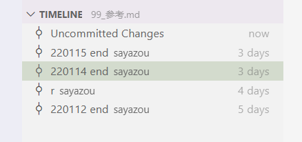

# Git简介

## 什么是Git
Git 是一个开源的分布式版本控制系统。是Linux之父为了帮助管理 Linux 内核开发而开发的一个开放源码的版本控制软件。与其他版本控制软件不同的是它采用了分布式版本库的方式，不必服务器端软件支持。

## Git与其他版本控制软件的不同点
1. 有很多其他的版本控制软件，例如早期的VSS，后续的SVN等等。与这些软件最大的不同就在于Git是分布式工具，可以脱离服务器端运行。每次克隆都包含了所有的文件与变更变更信息。所以Git可以脱离服务器就行代码变更管理，而SVN不能。
2. 另外Git有极其强大的分支管理理念，去解决不同代码的管理与协同工作等问题。

## 理解Git的工作流程

## Git 工作区、暂存区和版本库，以及时间线

* 工作区是指我们本地文件夹看到的工作目录与实际文件。
  使用 `git add`指令将变更添加到暂存区。
* 暂存区（Stage 或 Index）是缓存区域，临时保存本次提交前所做的变动。
  使用 `git commit` 指令将所有的暂存区文件提交到版本库中。
* HEAD是最后提交的版本指针。
* 时间线即所有提交版本的历史。

## 远端库与本地库
Git是分布式的版本管理工具，即并不需要一个集中式的服务器进行管理，每一个库都是可以独立运行的。
但是实际在工作中都是需要协同工作的，那么为了方便交换与集中所有的代码还是需要一个远端服务器对不同人员的代码进行集中管理与同步。
上面的操作都是指对于本地库的版本操作与管理，当需要从别人或服务器上获取，下载或提交代码时就需要使用 git clone, git pull, git push等操作来进行。

## 分支
不同的分支是在分支点后平行世界，可以并行编写互不干扰。

使用 `git merge` 可以将不同的分支进行合并。