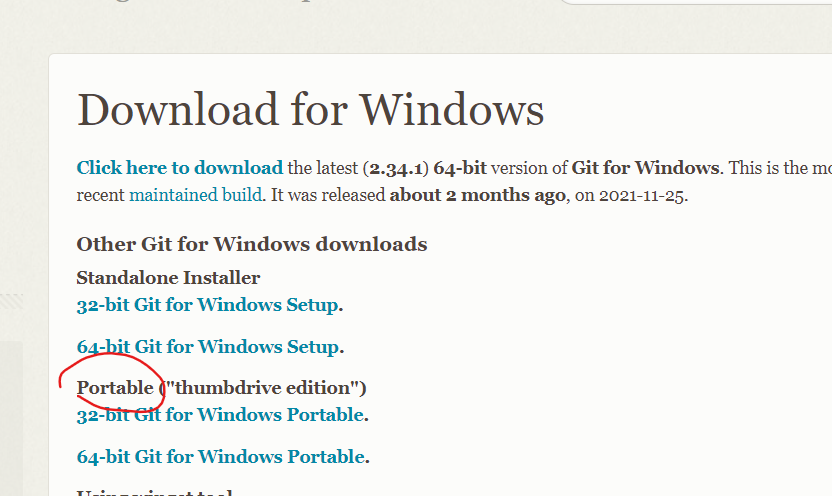
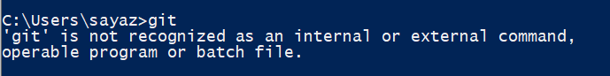
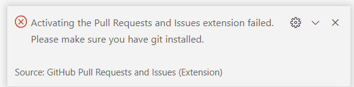
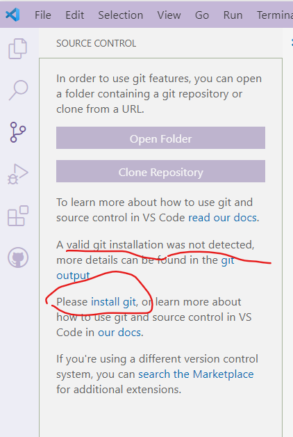
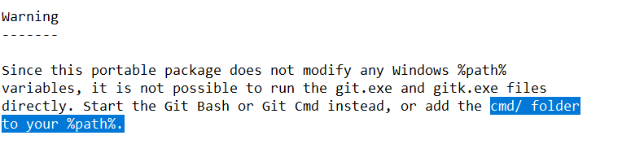
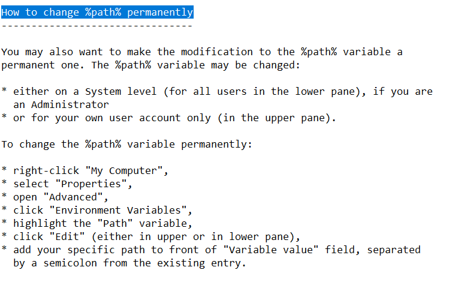
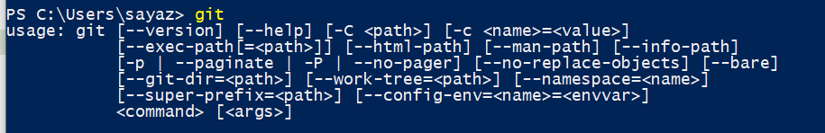
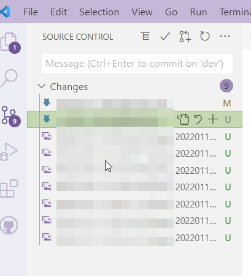

<!-- @import "[TOC]" {cmd="toc" depthFrom=1 depthTo=6 orderedList=false} -->

# 如何配置并在VScode中使用免安装版Git

<!-- code_chunk_output -->

- [如何配置并在VScode中使用免安装版Git](#如何配置并在vscode中使用免安装版git)
  - [下载免安装版Git](#下载免安装版git)
  - [检查Git环境](#检查git环境)
  - [配置Git环境](#配置git环境)

<!-- /code_chunk_output -->

## 下载免安装版Git
下载在 [Git官网](https://git-scm.com/download/win) 中下载对应的免安装版本。

下载后直接打开自解压（文件是7z进行打包的）至自己想要的本地路径中。

## 检查Git环境
解压后的文件可以直接打开里面的"git-bash" 或 "git-cmd"进行使用。但是操作系统与其他调用git的软件是认不到的。

可以做以下操作验证一下：
* 直接cmd中git命令显示如下：

* 打开VSCode会显示git相关的拓展加载失败，需要安装git。

## 配置Git环境
所以这个时候就需要做一些配置使得系统可以认到该免安装版本的git，使得可以调用git的命令。

找到Git文件夹根目录内的“README.portable”文件，使用文本打开。
可以看到如下提示：

> 
> 

添加环境变量 "[git路径]\cmd\"以后，再执行git命令或vscode中都可以检查到变更与执行git操作。

