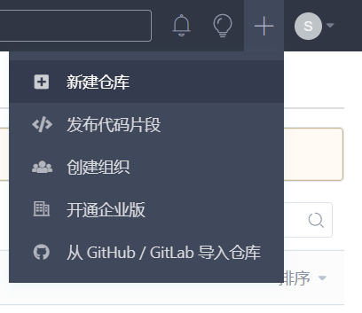
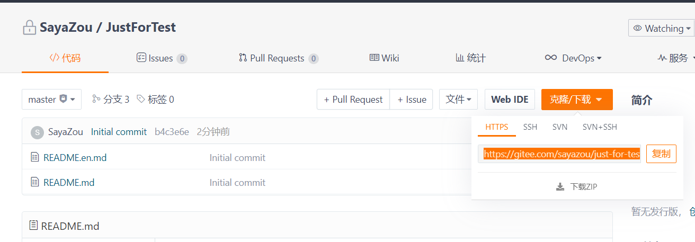
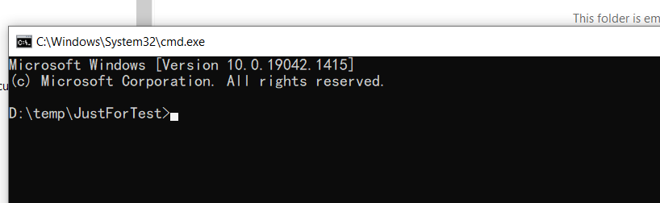
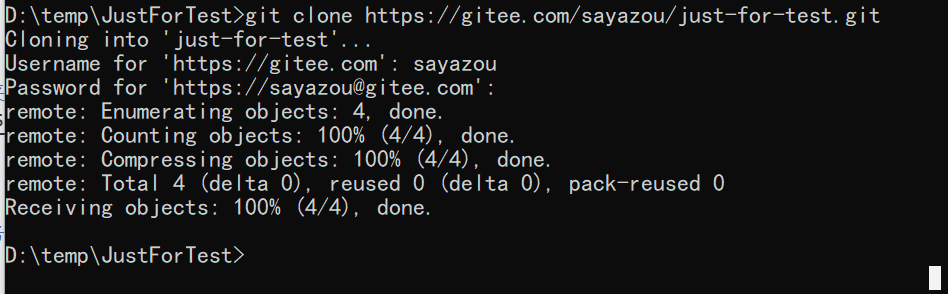
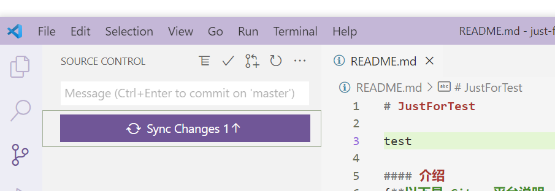
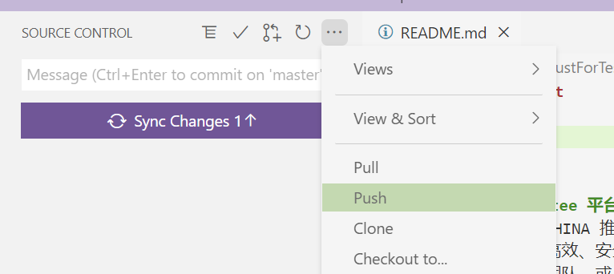
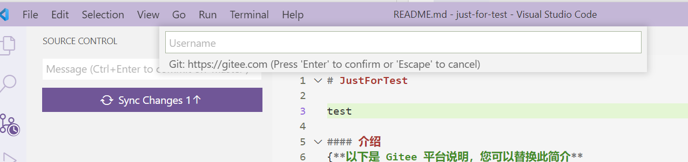
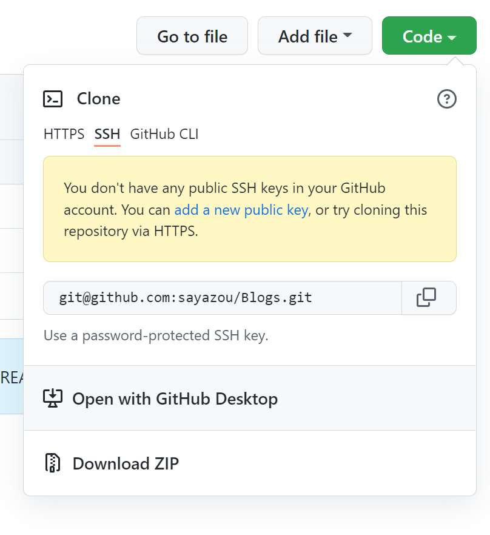
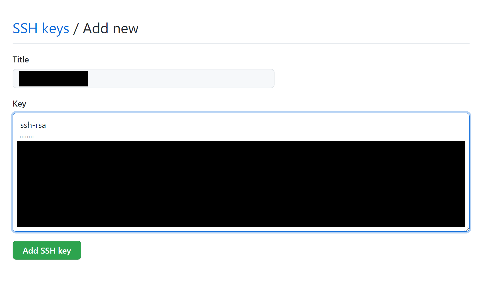
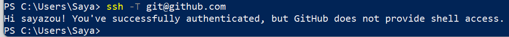

# 如何配置与提交至Git
为了方便与顺利（原因你知道的...）演示，使用码云作为样例。

## 创建仓库



## 配置本地用户名设定
```bash

git config --global user.name "test"
git config --global user.email test@mailhost.com

#检查是否已经配置成功
git config --global -l
```

## 使用https协议时
1. 从云端上获取地址。

2. 在本地新建一个空文件夹，用于获取远端分支，并在此文件夹中使用命令行打开。

   
3. 执行以下命令从远端服务器克隆项目至本地
看到100%就说明成功了。
```bash

git clone https://gitee.com/sayazou/just-for-test.git
```


4. 然后用VScode打开，稍作修改并提交，尝试push，需要输入用户名密码校验后。





## 使用SSH协议时
使用SSH协议不用每次都输入密码，如果长期在这个电脑上使用会很方便。

1. 从云端库上获取SSH地址，此链接会作为后续建立远程库时使用。



2. 在本地需要进行git管理代码的文件中，运行一下命令行.
```bash

git remote add git@github.com:sayazou/Blogs.git
```

3. 在本地执行一下命令行生成SSH公钥
```bash

ssh-keygen -t rsa -C "your_email@xxx.com"
# 所有提示点击回车
```

4. 再执行以下命令查看公钥
```bash

cat ~/.ssh/id_rsa.pub
# 复制显示的公钥
```

5. 到云端库的Setting->SSH and GPG keys中添加公钥


6. 添加成功以后，回到本地执行命令查看是否可以正常通信。如果看到是类似以下Successfully...就说明成功了。


7. 尝试提交代码，如果提交成功说明没有问题。