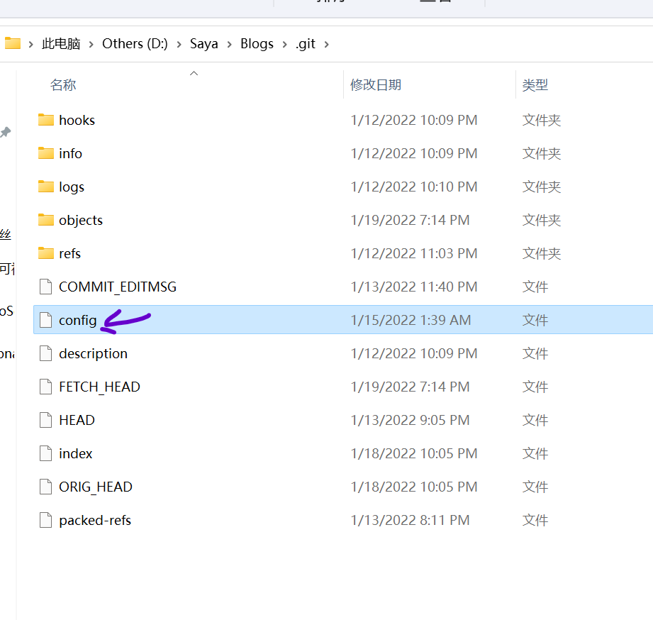
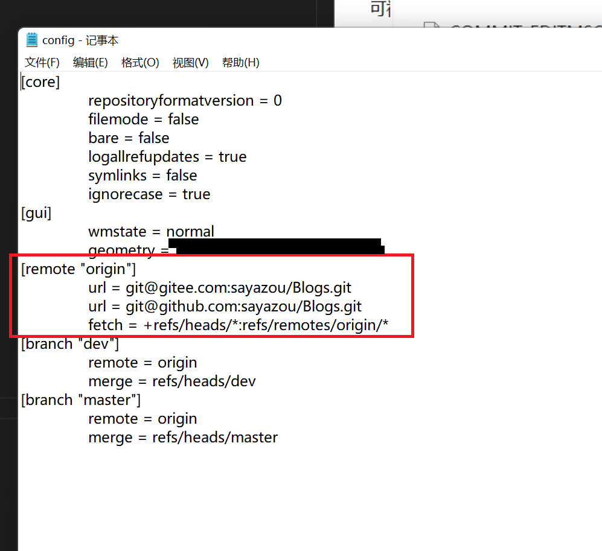

# 如何同时提交github与gitee

## 建议使用SSH协议
参考 [如何配置与提交Git](2_如何配置与提交Git.md)  中关于SSH的部分分别配置github与gitee。

## 修改git的config文件
找到本地库中".git"隐藏文件夹中的config文件。


使用文本打开查找remote段落, 进行如下修改。


```
[remote "github"]
	url = [github link]
	fetch = +refs/heads/*:refs/remotes/github/*
[remote "gitee"]
	url = [gitee link]]
	fetch = +refs/heads/*:refs/remotes/gitee/*
```

改为:
```
[remote "origin"]
	url = [github link]
	url = [gitee link]
	fetch = +refs/heads/*:refs/remotes/origin/*
```

## 测试

