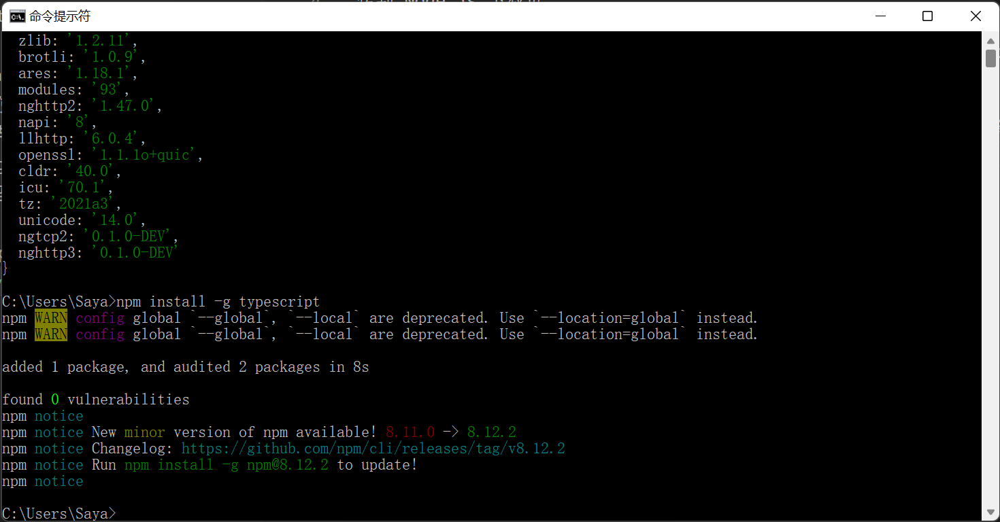
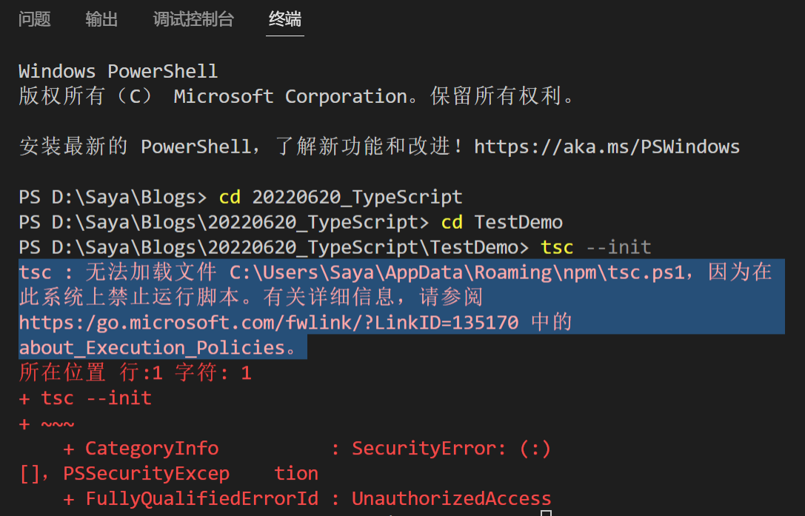
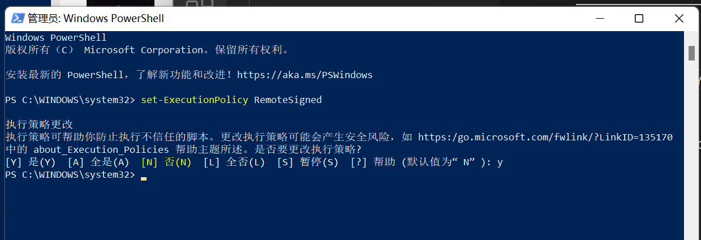

# 安装配置TypeScript环境

## 安装Node.js 与 npm
转到 Node.js 下载页。
选择 Node.js 的任意可用版本，进行下载和安装。
若要验证是否已安装 npm，请打开“命令提示符”窗口，然后输入 npm version。

有npm以后，在“命令提示符”窗口中，输入 npm install -g typescript。
输入 tsc 确认已安装 TypeScript。 如果已成功安装，则此命令应显示编译器命令和选项列表。




## 更改Windows脚本执行策略
当在终端运行TS脚本命令时遇到以下错误，则需要设定设定Windows的脚本执行策略。


以管理员身份开启Windows Powershell
输入指令,并输入Y或A确认:

```
set-ExecutionPolicy RemoteSigned
```



参考：
https://docs.microsoft.com/zh-cn/powershell/module/microsoft.powershell.core/about/about_execution_policies?view=powershell-7.2


## TypeScript在VSCode中的练习
https://docs.microsoft.com/zh-cn/learn/modules/typescript-get-started/6-typescript-project
