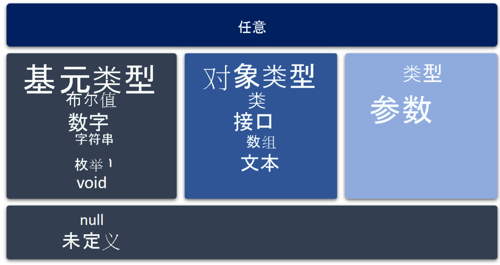
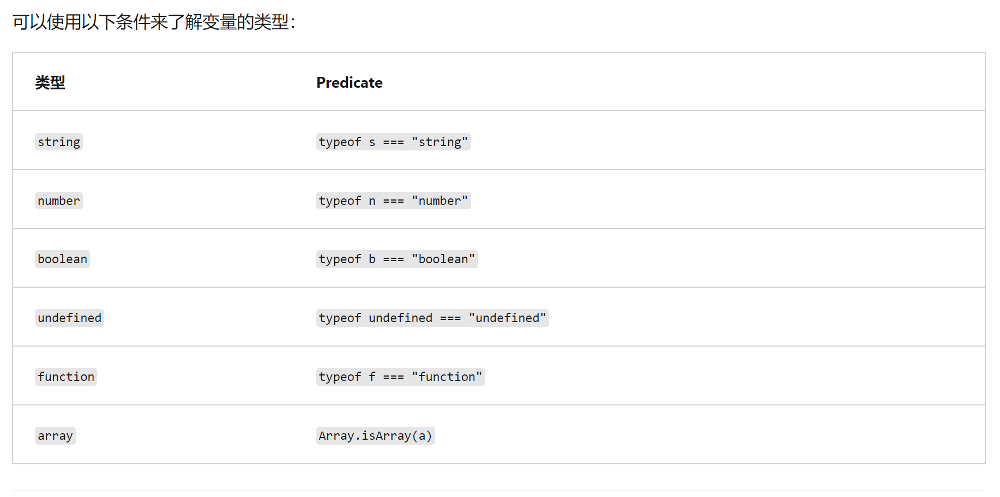

# 基础

## 声明 let 和 const 变量
TypeScript 鼓励将 let 和 const 关键字用于变量声明。

> 提醒一下，它们之间的区别在于，let 声明可以在不进行初始化的情况下完成，而 const 声明始终使用值进行初始化。 const 声明分配后，就无法再重新分配。

let 用于声明可变变量，且可以初始化时不赋值。
const 用于声明不可变量，初始化时需要赋值。


## 类型
any 是所有类型的父类型。



基元类型：
boolean, number, string, void, null, enum 和 undefined。
void 类型的存在纯粹是为了指示不存在值，例如存在于没有返回值的函数中。
null 和 undefined 类型是所有其他类型的子类型。 无法显式引用 null 和 undefined 类型。 使用 null 和 undefined 字面量只能引用这些类型的值。

### 基元类型
布尔型： boolean

数字类型和大整数类型： number， bigint。 TypeScript中所有的数字都是浮点型或大整数型。

字符串：string。
在 TypeScript 中，还可以使用模板字符串，该模板字符串可以跨越多行并具有嵌入式表达式。 这些字符串由反撇号/反引号 (`) 字符括起，并且嵌入式表达式的形式为 ${ expr }。
``` TypeScript
let firstName: string = "Mateo";
let sentence: string = `My name is ${firstName}.
    I am new to TypeScript.`;
console.log(sentence);
```

枚举类型：enum。
枚举允许指定可用选项的列表。 当你有一组特定变量类型可能采用的值时，它们非常有用。 假设你在名为 ContractStatus 的外部数据库中有一个字段，该字段包含数字 1、2 或 3，它们表示以下合同状态：Permanent、Temp 和 Apprentice。 我们将使用这些值创建一个枚举，并探索 TypeScript 支持。

打开 Playground 并删除所有现有代码

通过输入以下内容创建 enum 来代表我们的场景：

TypeScript

复制
enum ContractStatus {
     Permanent,
     Temp,
     Apprentice
}
现在，为类型为 ContractStatus 的名为 employeeStatus 的新员工声明一个变量，并分配 "Temp"。 将结果显示到控制台。

TypeScript

复制
let employeeStatus: ContractStatus = ContractStatus.Temp;
console.log(employeeStatus);
选择“运行”。 注意“日志”窗口中显示的值。 返回的值是什么？

默认情况下，enum 值以 0 开头，因此 Permanent 为 0，Temp 为 1，Apprentice 为 2。 如果希望值以不同的值开头，在本例中是 1，请在 enum 声明中指定该值。 进行以下编辑，使 enum 的值从 1 开始。

TypeScript

复制
enum ContractStatus {
     Permanent = 1,
     Temp,
     Apprentice
}
通过选择“运行”来重新运行代码。 请注意，现在显示的值为 2。

若要显示与枚举关联的名称，我们可以使用提供的索引器。 将以下内容添加到你的代码底部：

TypeScript

复制
console.log(ContractStatus[employeeStatus]);
运行代码。 注意，将显示值 Temp，它是 Temp 或 2 的枚举的名称。


任何类型： any。
any 类型是可以无限制地表示任何 JavaScript 值的一种类型。 当你期望某个值来自第三方库或值为动态的用户输入时，此功能很有用，因为 any 类型将允许重新分配不同类型的值。请记住，any 的所有便利都以失去类型安全性为代价。 类型安全是使用 TypeScript 的主要动机之一。 如果不需要，应避免使用 any。

unknown类型
any 和 unknown 之间的核心区别在于你无法与 unknown 类型的变量进行交互；这样做会产生“编译器”错误。 any 将绕过所有编译时检查，并且在运行时评估对象；如果该方法或属性存在，它将表现出预期的效果。

### 类型断言 与 类型保护
类型转换：(randomValue as string)
类型判断： typeof === "XXX"



### 集合类型
#### 数组
方法1：
``` TypeScript
let list: number[] = [1, 2, 3];
```

方法2（使用泛型）:
``` TS
let list: Array<number> = [1, 2, 3];
```

#### 元组
一个数组可能包含混合类型的值。 为此，TypeScript 提供了元组类型。若要声明元组，请使用语法 variableName: [type, type, ...]。
注意TS的元组与Python的元组概念不同。
``` TS
let person1: [string, number] = ['Marcia', 35];
```